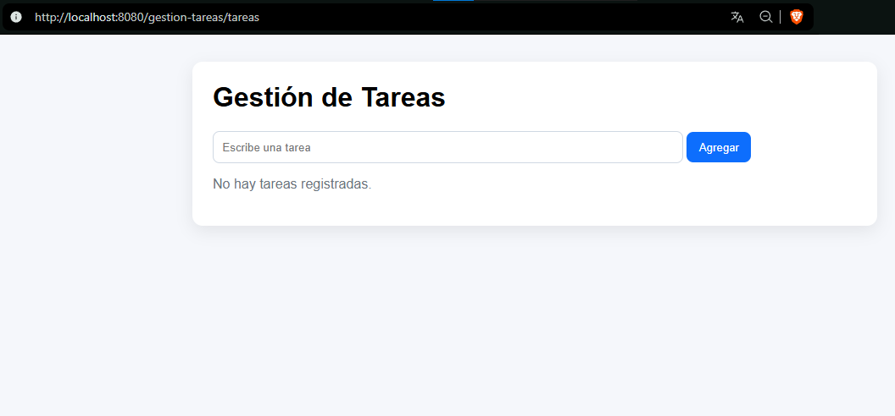
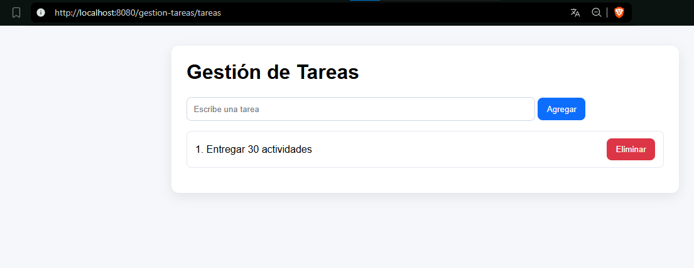
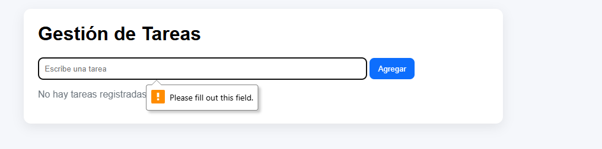

# daza-post1-u5

Aplicación Java Web con Servlets y JSP para gestionar tareas en memoria.

## Funcionalidades

- Listar tareas existentes (GET /tareas)
- Agregar tarea nueva (POST /tareas, accion=agregar)
- Eliminar tarea por i­ndice (POST /tareas, accion=eliminar)
- Patrón Post/Redirect/Get para evitar reenvio al recargar

## Prerrequisitos

- JDK 17+
- Maven 3.8+
- Apache Tomcat 10.x

## Ejecución

1. Compilar: mvn clean package
2. Desplegar el WAR generado en Tomcat
3. Abrir: <http://localhost:8080/gestion-tareas/tareas>

## Estructura

- src/main/java/com/ejemplo/gestiontareas/servlet/TareaServlet.java
- src/main/webapp/WEB-INF/views/tareas.jsp
- src/main/webapp/index.jsp

## Capturas

### Listado de Tareas

### Agregar Tarea

### Error al agregar tarea vacia

